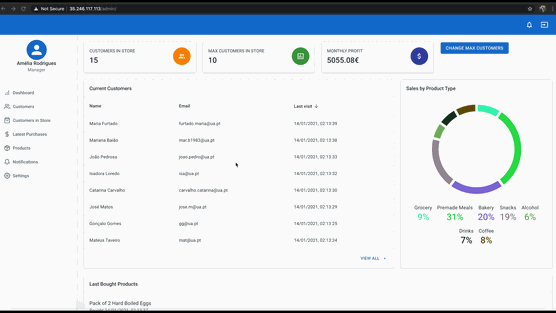

<p align="center">
  
</p>

<p align="center">
 System for monitoring clients and products at an automated self-service store. 
</p>
---

This project was developed in the context of [Introduction to Software Engineering](https://www.ua.pt/en/uc/12288) curricular unit, part of the Computer Science Bachelor at [Aveiro University](https://www.ua.pt/). It was lectured by [José Oliveira](https://www.ua.pt/pt/p/10309676) during the 2020/2021school year.

Each student was graded a different note. Chech [Authors](#Authors) for more information.


<p align="center"><a href="https://youtu.be/6S7CLQYnE50">
    
  </a>
</p>

> See a demo video by clicking on the image above.


## About the project

The system aims to simulate a management of an automated self-service store, in which the client can enter, grab the things he needs and get out without human interaction or any phisical barrier, as it identifies the client actions and associates the products he grabs to his shopping bastet, charging him for its value as he leaves.

As this is an academic project and because the main goal was to manage a software engineering development process, we did not implemented the system with real sensors. Instead, we created a script that mimics it.


## Technology stack

The system was implemented in Spring Boot, with MySQL and MongoDB databases, comunicating through Kakfa message broker with the data generation script, which was written in Python. We The user interface was developed in React. 


## Execute locally

To execute locally you need to have Docker Compose installed and updated.

After making sure of it, follow the steps below:

1. Compile the service code (inside [projservice](projservice)) and execute the following command:

   ```
   $ mvn -DskipTests clean package
   ```

2. For each service, build the containers with the command below:

   ```
   $ docker-compose build
   ```

3. For each service, start its containers.

   ```
   $ docker-compose up -d
   ```

The app should be available at [localhost](http://localhost).


## Report

The report is available (in Portuguese) [here](reports/relatorio_final.pdf).

Information about the development process management can be found (in portuguese) at [READMEPT.md](READMEPT.md).


## Authors

[Alexandra Carvalho](https://github.com/alexandradecarvalho) (Graded 18)

[Gonçalo Matos](https://github.com/gmatosferreira) (Graded 19)

[Isadora Loredo](https://github.com/flisadora) (Graded 16)

[Hugo Paiva](https://github.com/hugofpaiva) (Graded 20)


